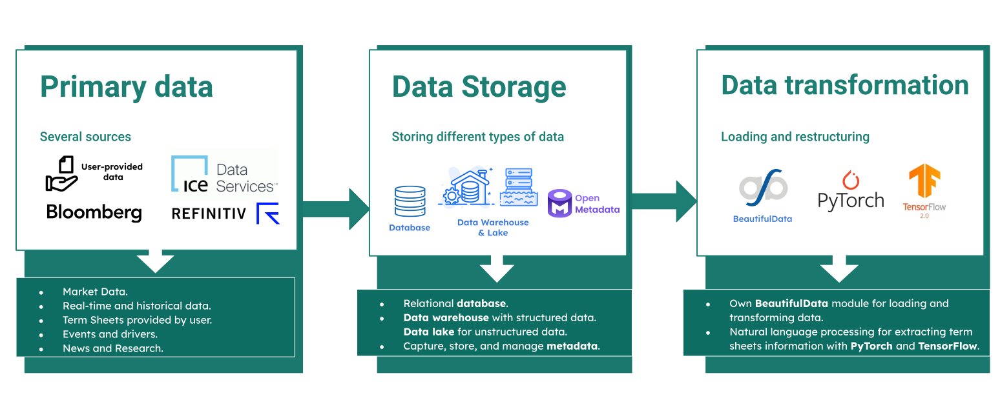
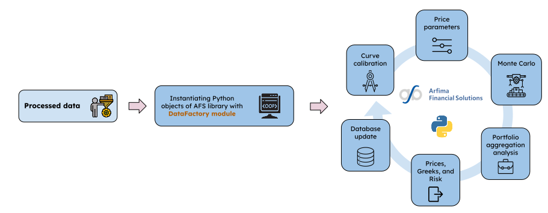
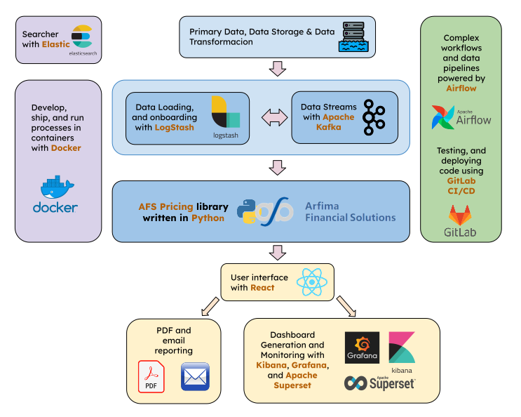

Platform workflow
=======================

The platform's workflow encompasses data aggregation, centralization, formatting, valuation, report generation and data visualization.
Our platform leverages a diverse set of tools to create a cohesive ecosystem that allows us to manage complex tasks efficiently,
from development to deployment and data management.
This process ensures that valuable insights are extracted from the data, empowering informed decision-making and comprehensive understanding.

We will explain step by step the different processes within the platform. We begin with the data collection and transformation:

We acquire data from reputable sources such as **Bloomberg**, **Ice Data Services**, and **Refinitiv**.
These platforms offer comprehensive and accurate information that serves as the backbone of our analytical processes.
In addition to these external sources, we also incorporate **user-provided data** into our system, particularly portfolios containing
specific products, determined by term sheets, our clients wish to evaluate. This personalized data enables us to tailor our analytics and recommendations
to the individual needs of each user.

The data collected is stored using a variety of technologies to suit the nature and volume of the data. For structured data, we employ **relational
databases**, which are ideal for ensuring data integrity and facilitating complex queries.
For handling large volumes of data, we utilize **data warehouses**. These are particularly beneficial for running complex queries across large datasets
and are optimized for read-heavy operations, like analytics and business intelligence applications.
For less structured or unstructured data, such as termsheets in PDF format, we use **data lakes**.
By leveraging the right technology for each type of data, we ensure that our storage solutions are optimized for performance, scalability, and ease of use.

To transform and load the data, we utilize a module from our in-house library, known as :py:meth:`beautifulData <data.data_factory_bd.DataFactory>`. In addition to this, we employ other tools such as **PyTorch**
and **TensorFlow2** specifically for Natural Language Processing (NLP). This enables us to automatically extract data from term sheets using machine
learning algorithms that have been pre-trained for this purpose.
This mix of in-house and open-source tools provides us with the flexibility and scalability needed to handle a wide array of data types and formats,
ensuring that we can quickly adapt to new data sources or processing requirements as they arise.

Once the data is appropriately transformed, we utilize our valuation library, which has been designed with modularity in mind.
This ensures that any updates or changes can be easily incorporated without affecting the rest of the library.

Using ``DataFactory``, the corresponding objects from our library are instantiated. Once these objects are in place, we proceed to **curve calibration**,
from which we derive the relevant **parameters** for our models.
The **Monte Carlo** technique is employed for valuation, providing a robust and flexible solution that is not product- or model-dependent. This allows
for the valuation of almost any financial product. Following this, an **aggregate analysis** of the entire portfolio is conducted, calculating
**prices, Greeks, and risk measures**.

The pertinent data, which may be crucial for future recalibrations of the models, is then written to the **database**. This ensures that all relevant
information is systematically stored for both immediate analytics and future reference. This architecture not only maximizes the efficiency of our
valuation process but also adds a layer of future-proofing, accommodating new developments in both data sources and valuation methods. For more details on models, products, and
Monte Carlo techniques, please refer to the rest of the documentation available on our website.

The results of these processes are subsequently displayed using interactive dashboards built with tools like **Superset**, **Grafana**, and **Kibana**.
These dashboards offer real-time insights into valuation and risk metrics, presenting a comprehensive view of the data for better decision-making.
Additionally, we generate automated reports that can be sent directly via email. These reports provide a detailed analysis of the portfolio,
including key performance indicators and other relevant metrics. This feature is particularly useful for stakeholders who require periodic updates
but may not have the time to interact with the dashboards directly.

To execute all these processes, we rely on a suite of diverse tools that make the platform more robust, scalable, and efficient.
The integration of these tools helps us build a comprehensive solution that addresses various needs — from data ingestion and transformation to
analytics and deployment — all within a unified platform. This multi-tool approach ensures that we are equipped to handle the complexities of modern
data processing and analytics, making our platform a one-stop solution for all valuation and risk assessment needs.

For developing, shipping, and running processes we use containers within **Docker**. This lightweight and flexible solution ensures consistency
across different environments. With **Airflow** we orchestrate complex workflows and data pipelines, offering a programmable environment to handle tasks.
For continuous integration and continuous deployment we use **GitLab CI/CD**, which integrates with our code repositories, automating the processes of
code testing and deployment. It helps us maintain a high standard of code quality and speeds up the development cycle.
Searching capabilities within the platform are powered by **Elastic**. Its scalable and real-time search features help us query large datasets efficiently,
providing valuable insights into our data.
**LogStash** is used for data loading and onboarding. It plays a critical role in the initial stages of our data pipelines, capturing data from various
sources and sending it to our storage systems or directly to analytics tools for real-time insights.
Lastly, **Apache Kafka** handles our data streams. Its high-throughput and fault-tolerant capabilities make it a robust choice for real-time analytics and
monitoring, as well as for integrating different components of our data architecture.

